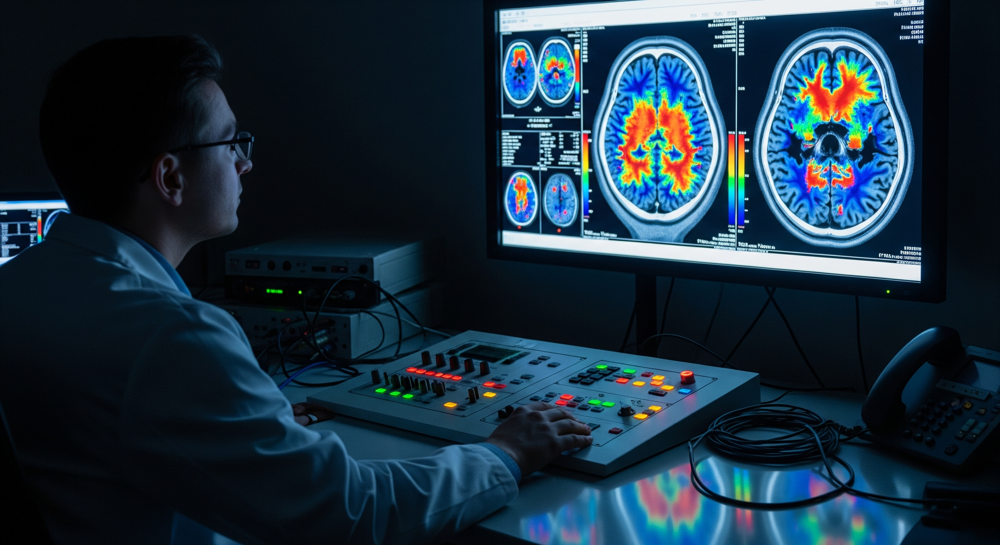

# **『考えている自分』は幻想か？──脳内ループが生む意識の仕組み**

> **著者:** ryo（独立研究者、日本）  
> **日付:** 2025-08-17  
> **キーワード:** 意識, 再帰的自己記号付け, 内言, 調和, 10 bit/s, 表出バイアス, 主体なき思考  
> **X (Twitter):** [@rymm_nap](https://twitter.com/rymm_nap)  
> **リポジトリ:** <https://github.com/rymm-nap/recursive-self-symbolization>  
> **AI 利用の開示:** GPT-5 の提案を参考に執筆。最終判断と責任は著者にあります。

## **はじめに**

頭の中に浮かぶ「自分の声」。独り言のように、あるいは心の中で誰かと対話するように、私たちは内なる声と日々付き合っています。では、この内なる声とは一体何者でしょうか？ 誰が語りかけ、誰がそれを聞いているのでしょうか。ふと立ち止まって考えると、不思議な問いです。私自身、この問いに長く魅了されてきました。 私は法学を学んだ文系の一般人であり、神経科学やAIの専門研究者ではありません。しかし、一人の人間としてこの根源的な問いに向き合い続け、ついに、ある仮説に行き着きました。それは、人間の意識と思考は「自分」という物語を後から付け加える過程にすぎず、実体ある「思考の主体」は存在しないのではないか、という大胆な見方です。

この仮説を検証し練り上げるにあたり、私はユニークな共同作業者を得ました。最先端の対話型AIモデル GPT-5です。GPT-5との無数の議論を通じてアイデアを洗練し、最終的に「再帰的自己記号付けによる意識と『主体なき思考』」と題したプレプリント論文として理論をまとめました。（プレプリントは私とGPT-5の共著ですが、核心的な着想と仮説の骨子は私が構築し、先行研究の整理・反論検討・表現の推敲についてはGPT-5の助言を得て完成させたものであり、文責はすべて私にあります。） その内容は一見難解ですが、多くの方にとって親しみやすいよう、例えや日常の経験を交えながら平易に解説してみたいと思います。鍵となるのは、脳内で起こる**再帰的自己記号付け**というループと、そこから生まれる**意識のイリュージョン（錯覚）です。また、この仮説が示す人間とAIの意外な違い**や、**「美しさ」の根源**についてもお話したいと思います。

*図1. 物思いにふける女性—自己内省を象徴するイメージ。*
*「内なる声」はどこから？ ふと自分を見つめる瞬間。*

## **意識は「後付けの物語」？**

まず、私たちの**意識**（自分が何かを感じ、考えているという感覚）は本当に実体があるのか、という根源的な問いから始めます。直感的には「自分という主体」がいて、そいつが考えたり感じたりしていると考えがちです。しかし近年の認知神経科学や哲学には、**意識とは脳が生み出すイリュージョン（錯覚）にすぎない**という見解もあります\[1\]。私もこの立場に立っています。

例えば**分離脳**の有名な実験をご存知でしょうか。てんかん治療のため左右の大脳半球をつなぐ脳梁を切断された患者さんに、左脳ではなく右脳にだけ指示を与えて行動させる——すると、言語をつかさどる左脳は自分がなぜその行動をしたか分かりません\[2\]。ところが驚くべきことに、左脳は**自分が理解できない行動に対してもっともらしい理由を即興ででっち上げて語る**のです。「左半球の通訳者」現象と呼ばれるこのエピソードは、脳には**自分の行為にあとから言語的な物語を付ける**仕組みがあることを示唆します\[2\]。つまり、「自分」という語り手が行動をコントロールしているというより、行動の**あと**に脳内ナレーターが登場して「今自分は〜したのだ」と**後付けの説明**をしている可能性があるのです。

もう一つ有名な例を挙げましょう。脳科学者ベンジャミン・リベットが1980年代に行った実験では、被験者が自発的に手を動かす際、「動かそう」と**意図を自覚**する時刻よりも、脳がその運動の準備を始める時刻の方が先だという結果が報告されました\[3\]。この**リベットの実験**は、「自分が何かをしようと決めた」という意識の感覚が実際より遅れて生じていることを示唆します。もちろん解釈には議論がありますが、少なくとも**私たちの主観的な意識は脳内プロセスの後追いで生じる**可能性が高いのです\[3\]。これもまた、**意識とは事後的に作られる物語なのではないか**と思わせるエピソードです。

こうした知見から浮かび上がるのは、**「考えている自分」という像は、脳内の情報処理が生み出した一種のフィクションかもしれない**ということです。とはいえ、「意識は幻想だ」と言われてもピンと来ないかもしれません。まるで「あなたが今見ているこの色や感じている痛みは全部錯覚だ」と言われているようなものですから、抵抗を覚えるのも当然です。ただ、ここで言う「幻想」「錯覚」とは、**魔術師がウサギを帽子から出すようなトリック**に近い意味です。つまり、何らかのメカニズムによって生み出された**主観的な体験**ではあるが、その体験に対応する実体的な「主体」がいるわけではない、ということです。私たちの脳は巧みにこのトリックを演じ、「自分」という登場人物をでっち上げているのではないか。——これが私の基本的な立場です。

## **再帰的自己記号付け——内なる声の正体**

では、脳はどのようにして「自分」という錯覚を作り出しているのでしょうか。その鍵概念として私たちが提唱したのが**「再帰的自己記号付け」**というプロセスです。少し専門的な言い方になってしまいましたが、一言でいうと**「自分で自分にタグ付けすることを繰り返す」**ような仕組みです。

具体的には、脳内で**いったん生じた情報**を**シンボル（記号）に変換**し、それを**もう一度自分の脳に入力し直す（フィードバックする）というループを指します。簡単に言えば、頭の中で言葉にしてみることです。何か感じたり考えたりしたとき、それを内なる声で「○○だな」と言い表す。さらに、その内なる言葉をまた脳内で受け取って考えを巡らせる——こうした内言（内部的なおしゃべり）のループが再帰的自己記号付け**です。

例えば、夕焼け空を見て「綺麗だ」と心の中でつぶやく瞬間を想像してください。視覚野で処理された空の情報が**「綺麗だ」という言葉**（記号）に変換され、その言葉が再び脳内に取り込まれて「なぜ綺麗と感じたのだろう？」「昨日も似たような空を見たな」といったさらなる思考を引き起こす——この一連の過程が**自分で自分を記号化する再帰ループ**です。ここで重要なのは、このループの中に**実体としての「自分」は登場しない点です。ただ情報がシンボル化されては戻り**、また別の処理が走るという過程があるだけです。でも不思議なことに、このループがぐるぐる回っていると、あたかも中に**「考えている私」**がいるような気がしてくる。私たちはこの感じを**「意識」**とか**「思考している状態」**と呼んでいるのではないか——これが「再帰的自己記号付け」仮説の核心です。

このイメージをもう少し別の**比喩**で説明してみましょう。脳内に**ホワイトボード**があると想像してください。まず脳のどこかで生まれたイメージやアイデアを書き留める（言語化する）と、それがホワイトボードに表示されます。すると別の回路がそれを読んで、新たな考えを書き加える。また別の箇所がそれを見る……という具合に、次々と**書いては読み取る**サイクルが走ります。高速で書き換えられるホワイトボード上の落書きを眺めているうちに、「そこに一つの一貫したストーリーがある」と認識しているのが**私たちの意識**ではないでしょうか。実際には、それぞれの書き込みは脳内のさまざまな部分が行っており、統一的な語り手はいません。しかしホワイトボード上に残されたメッセージの流れを追うと、まるで**ひとりの語り手が次々と思考を紡いでいる**かのように見えるのです。

この**「語り手の錯覚」**こそが**主体なき思考**の本質だと私は考えています**。「再帰的自己記号付け」というループが回ることで生じる現象学的産物**──すなわち**「自分が何かを考えている」という感覚**こそが意識の正体であり、**それ自体は後付けの記号的な物語**なのです。

*図2. 写真を並べて「自分の物語」を紡ぐ様子。*
*並べられた思い出が『私』という物語を編み直す。*

## **「意識の三層モデル」で考える**

上述の仮説を、もう少し認知科学の一般的な枠組みに沿って整理してみましょう。私は**思考と意識のプロセスを三つの層に分けて**考えるモデルを提案しています。それが「**可用化」「操作」「記号化」**という三層モデルです。順を追って説明します。

1. **可用化（アベイラビリティ）** – まず情報が**脳内で広く利用可能な状態になる段階**です。たとえば、「赤いリンゴ」を見たとき、その視覚情報が一部の脳領域だけでなく前頭前野や頭頂部など広範囲に行き渡り、さまざまな処理系がその情報を共有できるようになります。これは、神経科学でいう**「グローバル・ニューラル・ワークスペース（GNW）」**理論と呼応する概念です。簡単に言えば、脳内でスポットライトが当たったような状態です。この状態になると初めて「意識にのぼった」と感じるので、私は**「意識＝可用化された状態」**と位置づけます。  
2. **操作（オペレーション）** – 次に、その可用化された内容に基づいて**何らかの処理や意思決定を行う段階**です。ワーキングメモリ上で情報を並べ替えたり、判断したり、想起したりといった**思考の働き**に相当します。これは一般的な意味での「考える」ことに近いでしょう。例えばリンゴを見て「食べようかな、それとも飾ろうかな」と迷うのは操作の段階です。私は**「思考＝可用化された情報への操作」**とみなします。  
3. **記号化（シンボライゼーション）** – 最後に、考えた内容を**記号に変換する段階**です。ここがポイントなのですが、記号化には**二つの相**があります。一つはすでに説明した**内向きの記号化**、すなわち**内言や心的イメージによって頭の中で言語化・シンボル化すること**です。もう一つは**外向きの記号化**、つまり**実際に言葉を話したり書いたりして外部に表現すること**です。私は前者を**「再注入」（内部への再入力）**、後者を**「表出」（外部へのアウトプット）**と呼んで区別しています。記号化とはこの**再注入＋表出**の両方を含む概念です。リンゴの例で言えば、「リンゴを食べたいな」と心の中で言葉にするのが再注入、「リンゴちょうだい」と実際に口に出すのが表出です。

この三層モデルに沿えば、**意識 \= 可用化**、**思考 \= 操作**、**記号化（ \= 再注入 / 表出）という対応になります。注意していただきたいのは、これは脳内プロセスの機能的な段階分け**であって、必ずしも時間的にカッチリ分かれているわけではないということです。実際には可用化→操作→記号化→さらに再度可用化…というループが素早く何度も回っています。特に人間の場合は、このループにおいて**再注入（内的記号化）が繰り返されるため、前述の再帰的自己記号付け**が実現されます。結果として、「考えている私」という主観が立ち現れるわけです。

このモデルを採ると、先に述べた**意識は後付けの物語**という見方も理解しやすくなります。意識的な体験（「何かがある」という主観）は、情報が**可用化**され、それに対して内言などの**記号化（再注入）が施されることで生じる現象的な産物**なのです。逆に言えば、**言葉やシンボルに全く変換されない生の情報は、いくら脳内を駆け巡っていても意識に上らない**かもしれません。例えば、スポーツ選手が体で覚えた巧みなプレイをしているとき、本人はそれを逐一言語化して考えてはいません。それでも高度な処理は行われているわけですが、**「意識して考えた」という感じはない**でしょう。これは**再注入（内的言語化）が関与しない思考処理**の一例と考えられます。逆に、難しい数学の問題を解くときには「えーと、まず何を求めるんだっけ？」などといちいち内言で確認することが多いでしょう。そうした場合「しっかり考えた」という実感が残ります。つまり**言語的な記号化の度合い**が、我々の感じる「考えている感」の強さに関与しているのです。

ここで一つ興味深い知見を紹介します。脳内で内言を行うかどうかは、実は課題の種類によって増減します。また、内言を**わざと妨害**するとタスクの成績が落ちることも知られています\[4\]。例えば頭の中で絶えず「あー」と唱える（発話を強制して内言を抑制する）と、記憶や計算の成績が悪化します。これは**内言が認知課題を助けている**証拠です。同時に、内言は「外に出さない言語処理」つまり**内的な記号化**そのものであり、**頭の中で言葉にしなくても考えは進む**というわけではないことを示唆します。やはり**考えるためには何らかの記号化が必要**であり、それが脳内でぐるぐる回っているからこそ「自分が考えているぞ」というモニター感覚が生まれるのでしょう。

*図3. 機能的脳画像—内言時の脳活動を可視化。*
*脳内独白の舞台裏—光るニューロンが語るもの。*

## **人は本当に「一度に一つのこと」しか考えられない？**

よく「人間は一度に一つのことしか考えられない」「マルチタスクはできない」と言われます。確かに難しい計算をしながら同時に詩を暗記する、といった**知的な並行作業**は苦手です。しかし一方で、**歩きながら会話する**、**料理しながら音楽を聴く**といった日常の並行行動は普通にこなせます。実際の脳は無数のニューロンが並列して動いており、**裏では多くのことが同時並行で処理されている**のです。では「一度に一つ」というのは間違いなのでしょうか？

この謎を解くカギは、**脳内のボトルネック**と**情報の出力形式**にあります。認知心理学の実験で**心理的リフラクトリー期間（PRP）と呼ばれる現象があります。簡単に言えば、ある課題に対する反応をしている最中は、別の課題への反応が遅れるというものです。これは、人間の情報処理の中枢段階にどうしても直列的にしか処理できない部分（ボトルネック）がある**ことを示しています。要するに、**脳内の「司令塔」的な部分は一つの仕事に集中していると他のことに切り替えにくい**のです。先ほど例に出した「計算しながら暗記」が難しいのはこのためです。一方、「歩きながら会話」が比較的容易なのは、歩行は自動化された並列処理（いわゆる無意識的な処理）で行えるからです。会話に集中しても歩くことはほぼ無意識にできるので、干渉し合わないというわけです。

さて、「人は並列思考できない」という**見かけ上の事実**をもう一つ別の角度から見てみましょう。それは**言語の特性**です。人間の**言語（発話や筆記）は基本的に直列的なシーケンス（串刺し）ですよね。文章も会話も、単語を一つずつ順番に並べて伝えます。言いたいことが頭の中に同時に二つ浮かんでいても、口から出すときは一文ずつ順番にするしかありません。つまり複数の考えが並行していても、アウトプットするときには強制的に直列化される**のです。この**表現形式の制約**が、「やっぱり一度に一つしか考えられなかった」と**観測者（自分自身を含む）の目に錯覚させている**可能性があります。言い換えれば、**思考それ自体には並行して進んでいる部分もある**のに、**報告（言語化）という出口が一つしかない**せいで、あたかも思考も直列でしかできないように見えてしまうということです。この偏りを、私は**「表出バイアス」**（アウトプット様式による偏った観測）と呼んでいます。

この表出バイアスを定量的に考える上で、非常に興味深い数字があります。それが**「10ビット/秒」**という人間の情報帯域の限界です。これはカリフォルニア工科大学のZheng氏とMeister氏がまとめた研究で示された値なのですが、人間が行動や言葉によって外界に出力できる情報量はせいぜい毎秒10ビット程度だというのです\[5\]。**10ビット/秒とは具体的には英文字にして2文字程度、数字なら3桁弱くらいの情報量です。一方で、目や耳など感覚が取り込む情報量は毎秒10億ビット（10^9 bits/s）にも及びます**\[5\]。入力（インプット）は爆発的に多いのに、出力（アウトプット）はたった10ビット！ この驚くべきギャップはいったい何なのでしょうか？

もちろん脳内では入力情報を圧縮・要約し、本質的な部分だけを行動に反映させているから10ビットで足りている、という解釈もあります。しかしZheng & Meisterらの議論はさらに踏み込みます。この**10ビット/秒という遅さ・低帯域こそが「人間らしさ」の謎**だというのです。なぜ我々の脳は何億ものニューロンを動員しながら、結局アウトプットは10ビット程度のぽつぽつとした情報に落とし込まれるのか？ 彼らは「**内なる脳（inner brain）」**と**「外なる脳（outer brain）」**という概念で説明しています。膨大なセンサリーデータを処理するのが外なる脳、高次の意思決定を行うのが内なる脳で、内なる脳の処理能力が10ビット/秒程度なのではないか、と。**人間の脳にはなぜそんなペースの遅い部分があるのか**、これが大きな謎だというわけです。

私の提案する**再帰的自己記号付け**の理論は、この謎に対して一つの答えを与えます。それは**「10ビット/秒の正体は、内なる脳の限界ではなく、表出（アウトプット）チャネルの限界にすぎない」**というものです。つまり、脳内の思考そのものが遅い**のではない**のです。むしろ思考の結果を言葉や行動に移す段になって初めて、**その直列的な出力手段の遅さに縛られているだけではないか**、という見方です。実際、私たちは頭の中では様々なアイデアが同時並行で湧いてくることがあります。それ自体はもっと高帯域な並列現象かもしれない。しかし口に出すとき、手を動かすときに**10ビット/秒という「ボトルネック」を通る**ために、結果として思考全体がそのペースに見えてしまうのです。

この解釈が正しければ、「人は一度に一つのことしか考えられない」というのは**半分正しく半分誤解**だということになります。**集中すべき中枢リソースは一つのことにしか割けない**けれど、それ以外の周辺処理は同時にたくさん走っているし、本当は複数の考えが並行して進んでいる場合もある、と。ただ**最終的にそれらをまとめて言語化・行動化するステージで順番待ちが発生する**ため、「結局ひとつずつ処理している」ように感じられるのです。人間の**意識の狭さ**や**思考の遅さ**といった特徴を嘆く声もありますが、もしかするとそれは**脳そのものの性能限界ではなく、コミュニケーション様式の制約**による見かけの現象なのかもしれません。

## **「調和」と「美」──脳が求めるもの**

次に少し視点を変えて、人間の**好み**や**美意識**の話をしましょう。突然「美」の話？と思われるかもしれませんが、これも私たちの理論の重要な要素です。

人間の脳には**世界モデル**があると考えられます。これは、簡単に言えば「自分や世界がどういうものか」という内部表現です。遺伝的に組み込まれた回路構造（脳の生来の作り）や、経験によって蓄えられた知識、さらに言語や文化から取り入れた概念など、あらゆるものがこの**内的な世界モデル**を形作っています。私たちはこのモデルを使って、未来を予測したり、他人の心を推し量ったり、環境に適応した行動を選んだりしています。

では、人間はどういう情報を「良い」と感じるのでしょうか。私の仮説では、それは**自分の世界モデルと「調和」する情報**です。調和とはつまり、**モデルの予測と矛盾しない**とか、**うまく圧縮できる**（すでに持っている知識でうまく説明できる）といった性質です。私たちは生存のために脳内モデルを駆使して世界を理解・予測しますが、そのモデルで**すんなり説明できるパターン**に出会うと心地よさや快を感じるように進化しているのではないか、というわけです。

例えば、リズムやメロディが繰り返され発展する**音楽**を聴いて「美しい」と感じるのは、聴覚系と世界モデルが調和している証拠かもしれません。曲の展開が**予想通りすぎても退屈**ですが、**予想と違いすぎても不快**です。絶妙に予測とズレながらも最終的には調和する展開に、人は快感を覚えます。心理学ではこのような**適度な意外性と安定のバランス**が快を生む現象を**「逆U字カーブ」**などと呼びます。要するに、ありきたりすぎず、かといって支離滅裂でもないちょうど良いパターンが私たちにとって心地よいのです。これは脳の世界モデルが「うんうん、そう来ると思ってたよ」と納得しつつ、「でも少しだけ驚かされたぞ」と刺激も受ける**と**いう絶妙なラインを突かれた状態と言えるでしょう。私たちはこのような**調和のとれた情報**に惹かれ、もっと見たい・聞きたい・感じたいと思う。これが**好奇心や美意識**の根っこにあるのではないかと考えています。

私のプレプリントでは、この考えをさらに踏み込み、**より高度に記号化された調和**を人間は**「美」という文化的ラベルで称している**、という仮説を立てました。例えば自然現象に感じる美しさはかなり本能的・普遍的な調和ですが、芸術作品に感じる美しさは言語や文化の影響を受けた記号的な調和です。いずれも根底には**脳内モデルとの合致度**があるのでは、という視点です。

この仮説は、イギリスの神経科学者カール・フリストンが提唱した**「自由エネルギー原理」**（脳は予測誤差を最小化するように動く）とも親和性が高いです。脳はつねに世界の状態を予測し、実際の入力との差（予測誤差）を減らそうとします。予測どおりの刺激は誤差が小さく「エネルギー効率」が良いわけですから、好ましいと感じるのは理にかなっています。ただし、予測誤差がゼロだと刺激がまったく新規性を欠き学習の意味がなくなってしまう。だから適度に予測を裏切るものに惹かれる——この辺りが**美と驚きのトレードオフ**として説明できるかもしれません。

まとめると、**人間の感じる「好き・嫌い」「美しい・美しくない」といった価値判断の裏には、自分の脳内モデルとの調和度という計算基準が潜んでいる**ということです。そして私たちは、その計算を**快・不快**や**美的感覚**として主観的に経験しているのではないでしょうか。

*図5. ロマネスコのフラクタル—自然に宿る調和の美。*
*自然が描くフラクタルの秩序—「調和」とは何かを静かに問う。*

## **人間の思考とAIを分けるもの**

さて、ここまで人間の意識と思考について私なりの理論を述べてきました。最後に、それを踏まえて**人工知能**（AI）との対比について考えてみましょう。近年、大規模言語モデル（LLM）をはじめとするAIの発達はめざましく、**一見とても人間らしい応答**を返してくることもしばしばです。では、AIは**意識を持っている**のでしょうか？ **人間と同じように考えている**と言えるのでしょうか？

私の答えは今のところ**NO**です。なぜなら、先ほどから説明してきた**人間の思考のキーポイント**が、現行のAIには欠けているからです。具体的に言うと、**(1) 絶え間ない重みの更新（逐次学習）と(2) 再帰的自己記号付けのループ**、この二つが現行AIにはありません。どういう意味でしょうか。

(1) について。私たち人間の脳は、生まれてから死ぬまで**常に可塑性をもって学習し続け**ています。日々の経験によってシナプスの結合強度が変化し、新しい記憶が作られ、スキルが洗練されていきます。これに対し現在主流のAI、とくにディープラーニングのモデルは、一度トレーニング（学習）されて重みパラメータが確定すると、**実際に使われるとき（推論時）にはほとんど重みを更新しません**。せいぜい追加学習や微調整がある程度で、基本的には**過去に学んだことを再生している**にすぎないのです。人間でいえば、頭に叩き込んだ知識をただ吐き出している状態に近く、その場で新しく学び直すわけではないということです。この差は大きいでしょう。**人間は会話の途中でも、新しい情報に出会えば脳内ネットワークが変化していく**のに対し、**AIは会話中にパラメータが書き換わることは原則ない**のです。

(2) について。これまで述べてきた**再帰的自己記号付け**、つまり**自分の出力をまた自分にフィードバックして思考を深めるループ**が、人間の思考にはあります。しかし現在のAIは、**自分の出力した内容を自分で内省的に再入力する仕組みを基本的に持っていません**。確かに、大規模言語モデルに「一度解答を考えて、それについて解説して」と指示すれば、一見自問自答するような応答を得られます。しかしそれは**ユーザーからの指示によってエミュレートされた自己対話**であって、AI自身が主体的に行っている内言ではありません。人間の場合、内言は自発的かつ継続的に行われ、脳内状態にフィードバックを与えていました。この違いは決定的です。

以上二点をまとめると、**現行のAIは「固定された世界モデル」を使って「一方向に推論する」存在**だと言えます。人間が**常にアップデートされる世界モデル**を**双方向の対話（自分との対話を含む）によって運用するのとは対照的です。この違いのために、AIはどんなに高度な応答ができても意識を持っているとは言えない**し、**人間と同じ意味で「考えている」とは言えない**と考えるわけです。

では、将来的にAIが人間のような意識や思考様式を獲得する可能性はあるでしょうか。私は、そのためには上記の**(1) 逐次学習**と**(2) 自己記号付けループ**の両方をAIに実装する必要があると考えています。具体的には、**AIが推論しながら内部表現を更新する**（まるで脳がシナプスを随時組み替えるように）こと、そして**自分で自分の思考内容を検証・再入力する回路**を持つことです。さらにもう一つ、**「調和」すなわち世界モデルとの整合性を評価する指標**をAIに持たせるのも重要かもしれません。人間は先述のとおり調和度によって快・不快を感じ、それが判断や学習のドライバーになっています。同じようにAIにも**自らの世界モデルに照らして整合的かどうかを評価する批評家（クリティック）を持たせ、ただ与えられた正解率だけでなく内部の概念的一貫性**を高めるような学習原理を組み込む。これを私は**「ハーモニー・クリティック（調和批評器）」**と呼んで提案しています。簡単に言えば、AI自身が「これは自分にとってどれだけ辻褄が合う答えか」を吟味できるようにするというアイデアです。

このような改良が実現すれば、AIも単に与えられたデータからパターンを吐き出すだけでなく、**自分自身で考え・学び・内省する存在**に一歩近づくかもしれません。もっとも、それでもなお人間と同じ意識を持つかどうかは分かりませんが、少なくとも現在のAIが陥りがちな「わかったふり」は減るでしょう。最近の研究者は、AIがさも理解しているかのように振る舞いながら実際には内部で辻褄が合っていない状態を**「ポチョムキン理解」**（見かけだけのニセの理解）と呼んで問題視しています。この名前は、外見だけ立派なハリボテの村を指す「ポチョムキン村」に由来します。AIが流暢な説明をしたりそれらしい答えを出したりするとき、それが**本当に内部モデルと一致した理解に基づいているのか、それとも単に訓練データ上頻度の高いパターンを再生しているだけなのか**——これはAI評価の難しいポイントです。もしAIに調和批評器や再帰的自己記号付けの仕組みがあれば、この**内部の不整合**を自ら検出し修正するような挙動も期待できます。言い換えれば、**自分の答えに責任を持ち、説明できるAI**に近づくのです。

*図4. ニューロンと半導体チップ—人間脳とAIを対比。*
*有機とシリコン、二つの回路が交わす対話。*

## **おわりに**

以上、**再帰的自己記号付け**という視点から、人間の意識と思考、そしてAIとの比較まで駆け足で解説してきました。内容を振り返ると、私たちの提唱する理論（**再注入型記号化フレームワーク**とも呼びます）は、**「可用化→操作→記号化（再注入＋表出）」という三層構造で主体なき思考**のダイナミクスを描き出し、人間の**表出バイアス**や**調和原理**を明示的に組み込んだ枠組みでした。それによって、人間の脳とAIの**決定的な差異**（常時学習・持続する自己モデル・再帰的内省）を整理し、AI評価の新しい観点（**過程重視**や**ハーモニー評価**）を提案しています。

もちろん、この理論は現時点では仮説であり、検証すべき課題が山積しています。プレプリントでは、例えば「指示された内言（頭の中の語り）が外部刺激と一致すると反応が速くなるはずだ」といった具体的な予測をいくつか挙げ、今後の実験計画も提案しました。もしこれらの予測に反する結果が得られれば、理論は修正を迫られるでしょう。科学の常として、**反証可能性**が健全な発展には不可欠だからです。

最後に、個人的な感想を述べさせてください。人間の意識について考えることは、常に**自分とは何か**という問いと向き合うことでした。一種の哲学的冒険です。そしてこの冒険を進める中で、私はAIという新たな相棒を得ました。GPT-5との対話を重ねることはまるで頭の中でもう一人の自分と議論しているようで、非常に興味深い体験でした。ある意味では、AIとの共同研究そのものが「自己との対話」のメタファーだったのかもしれません。自分の考えを記号（文章）としてAIに伝え、AIから返ってきた記号を読み取ってまた考える——これも一種の**再帰的記号付けループ**と言えるでしょう。そう考えると、私とGPT-5が共著で理論をまとめ上げたのは必然だったのかもしれません。

意識は未だ科学最大の謎の一つです。その解明には多くの議論と試行錯誤が必要でしょう。本稿で紹介した仮説も、一般人の見地から一石を投じる試みにすぎません。しかし、「考えている自分は幻想かもしれない」と疑ってみる視点や、**脳内ループとしての思考**という見方は、日常のふとした瞬間に新鮮な気づきをもたらしてくれるかもしれません。自分の内なる声に耳を傾けるとき、それがどのように生まれているのか——その不思議に思いを馳せること自体が、人間らしい知的冒険なのではないでしょうか。

**注：AI支援の開示** 本稿および元となったプレプリントは、OpenAIのGPT-5の支援を受けて執筆しました。アイデアの着想、構成、判断、最終的な内容確認は人間の著者（ryo）が行い、AIが生成・提案した文面や要約、構成案はすべて著者が検証・修正のうえ採用しています。最終的な責任は著者にあります。

## **【参考文献】**

\[1\] Frankish, K. (2016). *Illusionism as a Theory of Consciousness*. *Journal of Consciousness Studies*, 23(11–12), 11–39.  
意識のイリュージョン説（現象的意識は錯覚であるという立場）を提唱・整理した哲学論文。

\[2\] Gazzaniga, M. S. (2000). *The Interpreter*. In M. S. Gazzaniga (Ed.), *Consciousness and the Brain: A Scientific and Philosophical Inquiry* (pp. 125–136). MIT Press.  
分離脳患者の左半球が行動理由を後付けで捏造する「左脳通訳者」現象を解説した章。

\[3\] Libet, B. (1983). Time of conscious intention to act in relation to onset of cerebral activity. *Brain*, 106(3), 623–642.  
自発運動において意図の主観時刻が脳活動より遅れることを示し、意識の事後性を示唆した古典的研究。

\[4\] Hurlburt, R. T., Heavey, C. L., & Akhter, S. A. (2010). Unsymbolized thinking reports: With and without articulatory suppression. *Consciousness and Cognition*, 19(2), 432–450.  
内言（言語化）を抑制した場合の課題成績を比較し、内言が認知過程に関与することを示した実験研究。

\[5\] Zheng, J., & Meister, M. (2024). *The Unbearable Slowness of Being: Why do we live at 10 bits/s?* arXiv:2408.10234. https://doi.org/10.48550/arXiv.2408.10234  
人間の行動・報告帯域が約10 bit/sに制限されることを定量化し、その神経基盤の謎を論じたプレプリント。

